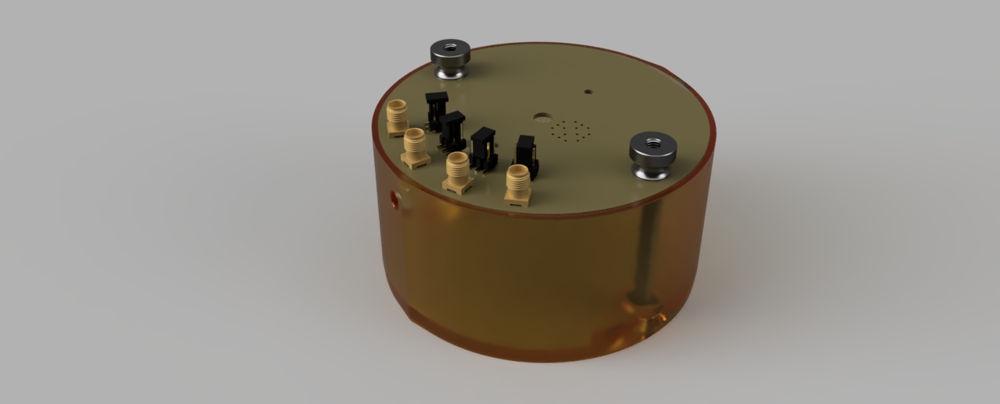

#   ICARO GUI -- Quick start Guide
  v.1 2020-08

###### author: Michele Della Ciana

Abstract
========

  ICARO is a program that drives a temperature controller. Actually it's
  implemented in two systems: an environmental chamber for temperatures
  measuremnt on TO (i.e. TO8, TO39) and an environmental chamber for
  operando measurements on an XRD (X-Ray diffraction) instrumentation.

Install ICARO
=============

ICARO is a java application. It's downloadable with source code as an
*.exe* file from the gitHub repository at
<https://github.com/micheledellaciana1/ICARO/tree/master/ICARO_EXE> or
as a *.jar* file at
<https://github.com/micheledellaciana1/ICARO/tree/master/target>.

ICARO needs to run java JRE 8 and Teensy 3.2 drivers installed. Usually
a java distrubution it's already installed, however you can download it
at <https://www.java.com/it/download/>.

Regarding drivers for Teensy 3.2, Linux, MAX OS, and windows 10
automatically checks for them whene the device is connected to and USB
port. If you are using an older versions of Windows OS you need to
download the corresponding drivers at
<http://www.pjrc.com/teensy/serial_install.exe>.

Once everything is setted up correctely, just connect the device and
double click on *ICARO.exe* icon.

As it starts, ICARO looks for serial devices connected to the pc (if
there aren't any, ICARO runs as a trivial simulation). At this point the
user as to select the right port from the drop down menu.

If everything is working properly, it will appear the main window of the
program, that shows the temperature of the sample in real time.

, the temperature of the controller, and the
temperature and the relative humidity of the enveromental chamber. Every
temperature is in celsius degree. To plot a set of data, from the main
window, click on *display*. It will appear a drop down menu with the
data that you can display.\
To monitor different data at the same time, in the diplay menú, there is
the option *duplicate view*. This command create a window that it's a
clone of the current main window. This new window displays the assigned
data untill it's closed.

To navigate data in a chart there are many commands:

-   Scroll the wheel to zoom in/out the cursor position

-   Press the wheel moving the cursor to pad

-   Zoom in a ROI (region of interest) with the left button while
    dragging down the cursor

-   Double click to zoom out the data

-   Set the autoscroll *ON* pressing the left button while dragging up
    the cursor.

To autoscroll the data there are two option: rescale the axes to fit the
entire dataset (default) or select a time window to display only the
last data collected. To set the autoscroll mode, go to *File\>Property
Chart\> FIFO scroll* and enter the dimension of the window (in seconds)
of the last data to display (negative value set autoscolls to default).

Set Menú
========

. Now you control the target
temperature of the sample (so you can't modify the voltage applied to
the heater, because it's controlled by the program).\
If the the system responds too fast or too slow, you can change the
feedback parameters from the feedback menú
(*Set\>Heater\>Feedback\>Parameters*). Here you have acces to four
parameters: the first three are the standard parameters of a PID system,
the fouth parameter, named sensitivity, acts as an attenuator of the
responce while the feedback approces the target temperature.

File Menú
=========

 or as a
text. Autosave it'snt implemented jet.

From *File\>Property Chart* it's possible to set the the scoll modality
of the chart, the updating frame rate (set slower frame rate for large
datasets) anche the theme of the GUI (Light or Dark).
